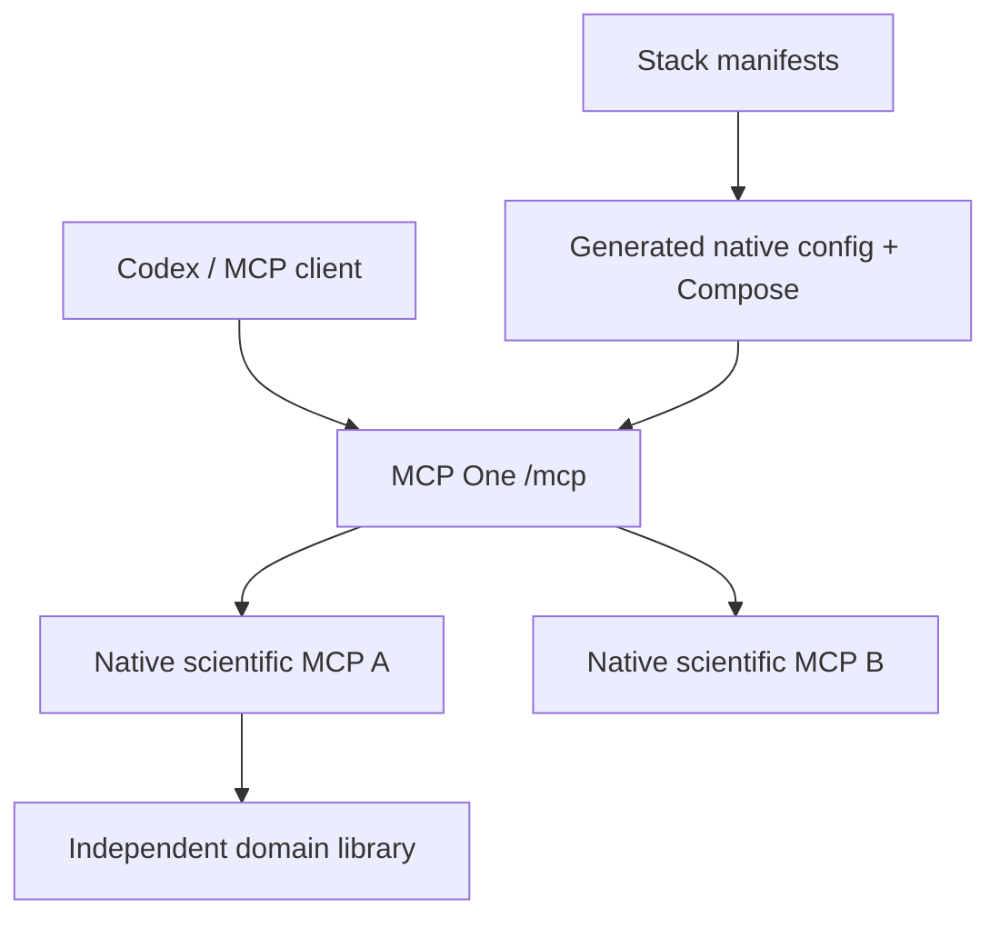

# Architecture

| Component | Responsibility |
| --- | --- |
| mcp-stack | composition, manifests, contract package, operation, integration tests |
| MCP One | native MCP edge/client, registry, routing, policy, retry/circuit safety, telemetry |
| Scientific MCP adapter | library invocation, typed schemas, ScientificResult and domain errors |
| Domain library | scientific meaning and algorithms, independent of MCP |

The normal core deployment has two processes: MCP One and the scientific mock.
Additional backends are added by manifest. There are no REST tool adapters or
legacy result envelopes. MCP One builds its catalog using native discovery and
returns CallToolResult unchanged except for additive gateway metadata.

MCP One maintains atomic operational snapshots, pooled HTTP clients and circuits;
none is semantic user-session state. The stack does not duplicate these mechanisms.
Native domains carry data/context/diagnostics/provenance; gateway tracing stays
in its own _meta namespace. The scientific contract package depends only on
Pydantic. MCP One does not import that package or interpret mathematical data.

Only the hub joins entrance and internal scientific networks and publishes a
loopback port. Backends remain on the internal network. ADR 0007 supersedes the
old four-process compatibility architecture. Historical audits remain explicitly
archived under docs/history, not operational instructions.

The gateway advertises tools only. Artifact/resource references survive, while
resource federation, sampling, subscriptions, tasks and multi-round workflows
are outside the current scope. No result caching is enabled.
